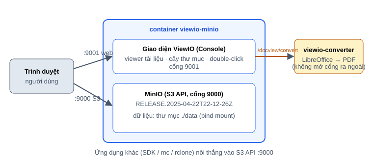

# ViewIO

**ViewIO = MinIO + giao diện xem tài liệu.** Cài một lệnh là có cả kho lưu trữ S3 (MinIO) lẫn giao diện web đã được nâng cấp:
xem trước PDF/Word/Excel/PowerPoint/Markdown/code/ảnh/video ngay trong trình duyệt, cây thư mục bên trái, double-click file để xem.



## Có gì khác MinIO gốc

| | MinIO Console gốc | ViewIO |
|---|---|---|
| PDF | khung nhúng thô, 5 trang đầu | pdf.js: thumbnail, zoom, tìm kiếm, nhảy trang, phím tắt |
| Word `.docx` | không xem được | dựng ngay trên trình duyệt |
| Excel `.xlsx`, CSV/TSV | không | bảng có lọc, nhiều sheet |
| PowerPoint, `.doc`, `.xls`, `.odt`, `.rtf`… | không | tự chuyển sang PDF bằng LibreOffice rồi xem |
| Markdown, code, log, JSON, YAML… | không | hiển thị đẹp, highlight, số dòng, tìm kiếm |
| HTML | không | **dựng như trang web thật**: CSS/ảnh/trang liên kết theo đường dẫn tương đối của thư mục đang duyệt (có hiện Base URL), script bị tắt để an toàn; xem được cả mã nguồn |
| Ảnh | xem tĩnh | zoom, kéo, xoay, lật |
| Mở xem | chọn file → bấm Preview | **double-click file** là xem |
| Chế độ xem | chỉ danh sách | **danh sách hoặc thumbnail** (ảnh, trang đầu PDF/Word/Excel/PowerPoint, khung hình video, nội dung đầu file text/CSV/code; loại khác dùng icon). Có cache, 3 cỡ thẻ, sắp xếp |
| Cột danh sách | Name · Last Modified · Size | Name · **Size · Last Modified**; dòng kẻ giữa các hàng nhạt, đỡ vướng mắt |
| Cây thư mục | không | thanh bên trái, bung/thu từng nhánh, kéo đổi độ rộng (mặc định ẩn) |
| Menu trái (thu nhỏ) | 80px | 40px |
| Giao diện sáng/tối | có | viewer theo đúng theme |

Phần lõi MinIO giữ nguyên (`RELEASE.2025-04-22T22-12-26Z`), dữ liệu và S3 API hoàn toàn tương thích.

## Cài đặt bằng Docker

**Yêu cầu:** Linux x86_64, Docker Engine 24+ kèm Docker Compose v2 (`docker compose version` chạy được), ~2 GB ổ trống cho image, có Internet để tải image.
Chưa có Docker (Ubuntu/Debian): `curl -fsSL https://get.docker.com | sudo sh && sudo usermod -aG docker $USER` rồi đăng xuất/đăng nhập lại.

Image dựng sẵn trên Docker Hub (chỉ **linux/amd64**):
[`ntanhprt/viewio`](https://hub.docker.com/r/ntanhprt/viewio) (MinIO + giao diện) và
[`ntanhprt/viewio-converter`](https://hub.docker.com/r/ntanhprt/viewio-converter) (đổi Office → PDF để xem PowerPoint/Word/Excel đời cũ).

### Cách 1 — Docker Compose (khuyên dùng, không cần clone repo)

```bash
mkdir viewio && cd viewio
curl -fsSLO https://raw.githubusercontent.com/ntanhprt/ViewIO/main/examples/docker-compose.yml

# Tạo file cấu hình .env: mật khẩu ngẫu nhiên + chạy bằng user hiện tại (để file dữ liệu không thuộc root)
printf 'VIEWIO_ROOT_PASSWORD=%s\nVIEWIO_UID=%s\nVIEWIO_GID=%s\n' "$(openssl rand -hex 12)" "$(id -u)" "$(id -g)" > .env

mkdir -p data
docker compose up -d
```

Chờ ~20 giây rồi kiểm tra:

```bash
docker compose ps                  # viewio-minio phải "healthy", viewio-converter "Up"
grep VIEWIO_ROOT .env              # xem mật khẩu (tài khoản mặc định: viewio-admin)
```

Mở **http://localhost:9001** (hoặc `http://<ip-máy>:9001` từ máy khác trong mạng), đăng nhập `viewio-admin` + mật khẩu ở trên.
S3 API ở cổng **9000**. Dữ liệu nằm trong thư mục `./data` — **sao lưu thư mục này**.

Đổi cổng, tài khoản, nơi lưu dữ liệu: thêm vào `.env` rồi `docker compose up -d`:

```bash
VIEWIO_ROOT_USER=admin               # tên quản trị (mặc định viewio-admin)
VIEWIO_CONSOLE_PORT=21031            # cổng giao diện web (mặc định 9001)
VIEWIO_API_PORT=21030                # cổng S3 API (mặc định 9000)
VIEWIO_DATA_DIR=/mnt/data/viewio     # nơi lưu dữ liệu (mặc định ./data)
VIEWIO_BIND=127.0.0.1                # chỉ cho truy cập từ chính máy (mặc định 0.0.0.0)
```

### Cách 2 — Một lệnh `docker run` (nhanh nhất để thử)

```bash
mkdir -p ~/viewio-data
docker run -d --name viewio --restart unless-stopped \
  -u "$(id -u):$(id -g)" -e HOME=/tmp \
  -e MINIO_ROOT_USER=admin -e MINIO_ROOT_PASSWORD='doi-mat-khau-nay-123' \
  -p 9000:9000 -p 9001:9001 \
  -v ~/viewio-data:/data \
  ntanhprt/viewio:2025-04-22 server /data --console-address ":9001"
```

Mở http://localhost:9001. Cách này **không có converter**: Word `.docx`, Excel `.xlsx`, CSV, PDF, ảnh, Markdown, code vẫn xem được;
chỉ PowerPoint và các định dạng Office đời cũ (`.pptx .ppt .doc .xls .odt .rtf`…) cần converter — dùng Cách 1 nếu cần.

### Cách 3 — Script cài đặt (clone repo)

```bash
git clone https://github.com/ntanhprt/ViewIO.git && cd ViewIO && ./install.sh
```

Tự tạo `.env` với mật khẩu ngẫu nhiên, kiểm tra cổng, tải image (không tải được thì tự build từ source, ~10–15 phút) và chạy. Có thêm `./viewio.sh` để vận hành.

### Dùng thử ngay

1. Đăng nhập → **Buckets → Create Bucket** → tạo bucket (ví dụ `demo`).
2. **Object Browser** → vào bucket → **Upload** vài file PDF/Word/Excel/PowerPoint (có sẵn trong thư mục [`samples/`](samples)).
3. **Double-click** vào một file để xem. Bấm dải mũi tên mỏng cạnh menu trái để mở **cây thư mục**.

### Quản lý (Cách 1)

```bash
docker compose logs -f minio          # xem log
docker compose restart                # khởi động lại
docker compose stop / start           # tạm dừng / chạy lại (tự chạy lại sau khi máy khởi động nếu chưa stop)
docker compose pull && docker compose up -d     # cập nhật lên bản mới (dữ liệu giữ nguyên)
docker compose down                   # gỡ container, GIỮ dữ liệu trong ./data
```

Đặt sau HTTPS/reverse proxy, sao lưu, bảo mật, xử lý sự cố: xem **[docs/INSTALL.md](docs/INSTALL.md)**.

### Đã có MinIO đang chạy, có dữ liệu? Chỉ nâng cấp giao diện

Không cần cài mới, không đổi cổng/dữ liệu/tài khoản: `docker pull ntanhprt/viewio:2025-04-22`, rồi đổi `image:` của MinIO cũ sang
`ntanhprt/viewio:2025-04-22` (hoặc thay binary nếu chạy systemd). Có rollback một dòng. Chi tiết từng bước:
**[docs/INSTALL.md mục 3b](docs/INSTALL.md#3b-đã-có-minio-đang-chạy--chỉ-nâng-cấp-giao-diện-giữ-nguyên-mọi-thứ)**.

**Hướng dẫn cài đặt chi tiết: [docs/INSTALL.md](docs/INSTALL.md)** · Dành cho người phát triển: [docs/DEVELOPMENT.md](docs/DEVELOPMENT.md)

## Vận hành (nếu cài bằng Cách 3 — `install.sh`)

```bash
./viewio.sh status      # trạng thái
./viewio.sh logs -f     # xem log
./viewio.sh restart     # khởi động lại
./viewio.sh update      # lấy bản mới + tải image + chạy lại (không mất dữ liệu)
./viewio.sh help        # tất cả lệnh
```

## Giấy phép

MinIO và MinIO Console là phần mềm **GNU AGPL v3**; ViewIO là bản sửa đổi của chúng nên phát hành theo cùng giấy phép (xem [LICENSE](LICENSE)).
Source đầy đủ nằm trong `src/`. Nếu bạn cung cấp ViewIO cho người khác qua mạng, AGPL yêu cầu bạn cung cấp source (kể cả các sửa đổi của bạn) cho họ.
ViewIO không liên kết hay được xác nhận bởi MinIO, Inc.
